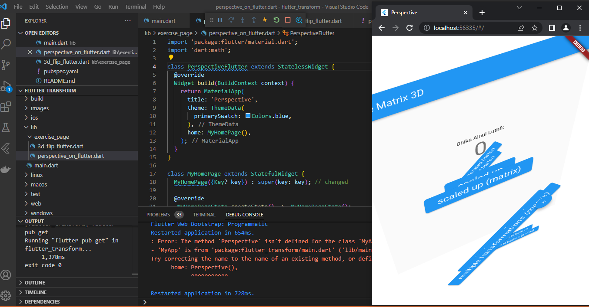
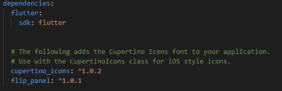
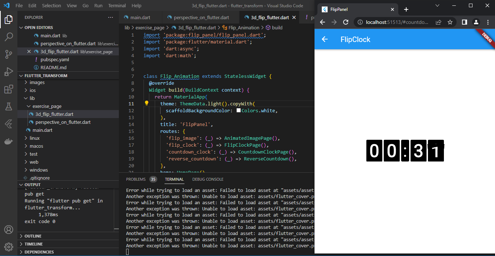

# Manipulasi Widget

## 1. Praktikum Manipulasi Widget

### Menambahkan impor dart:math

### Menambahkan kode transform dan menjalankan kodenya

## 2. Tugas Perspective on Flutter

## 3. Tugas Membuat 3D flip animation di Flutter

### Menambahkan plugin flip_panel di pubspec.yaml

### Menampilkan hasil 3D flip animation flutter

